<!-- Profile README for github.com/vibhorxpandey.
     Assets live in /assets. The contribution snake regenerates daily
     via .github/workflows/snake.yml. -->

<div align="center">




<p>
  <a href="https://veilresearch.com">veilresearch.com</a>
  &nbsp;·&nbsp;
  <a href="https://veilfinance.ink">veilfinance.ink</a>
  &nbsp;·&nbsp;
  <a href="https://pypi.org/project/aurelius-mcp/"><code>pip install aurelius-mcp</code></a>
  &nbsp;·&nbsp;
  <a href="https://orcid.org/0009-0009-2810-6222">ORCID</a>
</p>

</div>

<br>

## The Short Version

I'm a second-year B.Tech CSE (AI/ML) student at UPES, Dehradun, and I got impatient with toy projects early. So I ship production systems instead: **[Veil](https://veilresearch.com)**, the AI research infrastructure company I founded; **[Aurelius](https://github.com/vibhorxpandey/Aurelius)**, a fact-checked research MCP server on PyPI that refuses to show you a citation it hasn't verified; and a string of retrieval systems I benchmark properly before I talk about them. Recall@1 and MRR, or it didn't happen.

Away from the keyboard I trade Indian equities and crypto derivatives, I'm preparing for CFA Level 1, and I run a hyperlocal kirana delivery operation across 55+ shops. Logistics, it turns out, is just systems engineering with worse error messages.

First principles over frameworks. Verification over vibes.

<br>


## Current Threads

| thread | what it is | right now |
|:--|:--|:--|
| **[Veil Research](https://veilresearch.com)** | AI-native research infrastructure (the company) | hardening citation-enforced paper generation across five front-ends: web · CLI/SDK · MCP server · Skill · Claude Code plugin |
| **[Veil Finance](https://veilfinance.ink)** | AI research terminal for Indian small mid cap equities | a portfolio-aware materiality classifier over SEBI LODR Reg-30 labels, built with LightGBM and Mondrian conformal prediction |
| **[Aurelius](https://github.com/vibhorxpandey/Aurelius)** | fact-checked research MCP server | `v0.6.0` is live on PyPI. next: more verification backends and a deeper autonomous mode |

<br>


## Aurelius · the signature build (still building)

<div align="center">

<a href="https://pypi.org/project/aurelius-mcp/"></a>
&nbsp;
&nbsp;

</div>

A research assistant is only as good as its worst citation. **Aurelius** is a research MCP server that checks **every citation** against OpenAlex and Crossref (DOI-backed and retraction-aware) and **every claim** against live web sources, all before anything reaches you. It plugs into any MCP-capable app (Claude Desktop and Claude Code, Gemini CLI, Cursor, ChatGPT) and runs host-driven, so it needs no LLM key of its own. There's an autonomous mode for when you want it to run alone.

```text
topic -> screen -> draft -> fact-check -> revise -> you

inside fact-check:
  every citation  ->  OpenAlex + Crossref   (DOI-backed, retraction-aware)
  every claim     ->  live web sources      (verified before you see it)
```

```bash
pip install aurelius-mcp
```

<p align="center">
  <a href="https://github.com/vibhorxpandey/Aurelius"><b>Repository</b></a>
  &nbsp;·&nbsp;
  <a href="https://pypi.org/project/aurelius-mcp/"><b>PyPI</b></a>
</p>

<br>


## Veil · the company

Research tooling that treats verification as infrastructure instead of an afterthought.

<table width="100%">
<tr>
<td width="50%" valign="top">

<h3 align="center"><a href="https://veilresearch.com">Veil Research</a></h3>

<p>A unified AI workspace for researchers and ML engineers, with five expert modes and citation-enforced research-paper generation. Compile and export are <b>structurally blocked</b> on unresolved citations, so you can't ship an unverified claim even if you try.</p>

<p><sub><b>Architecture</b>: Supabase Postgres · libsodium BYOK encryption · LiteLLM gateway · five front-ends (web, CLI/SDK, MCP server, Skill, Claude Code plugin)</sub></p>

<p align="center"><a href="https://veilresearch.com">site</a> · <a href="https://github.com/vibhorxpandey/veil">repo</a></p>

</td>
<td width="50%" valign="top">

<h3 align="center"><a href="https://veilfinance.ink">Veil Finance</a></h3>

<p>An AI-native research terminal for Indian small and mid-cap equity markets. At its core sits a portfolio-aware materiality classifier over SEBI LODR Reg-30 disclosure labels, running LightGBM under Mondrian conformal prediction, so every signal carries a calibrated confidence guarantee instead of a guess.</p>

<p><sub><b>Architecture</b>: LightGBM · Mondrian conformal prediction · TypeScript front-end</sub></p>

<p align="center"><a href="https://veilfinance.ink">site</a> · <a href="https://github.com/vibhorxpandey/veil-finance">repo</a></p>

</td>
</tr>
</table>

<br>


## Selected Builds

<table width="100%">
<tr>
<td width="50%" valign="top">

<h3 align="center"><a href="https://github.com/vibhorxpandey/Echomind">EchoMind</a></h3>

<p><i>"The senior who never graduates."</i> An institutional-memory AI agent for college clubs. Hybrid retrieval over Qdrant (BM25 + dense + Reciprocal Rank Fusion + cross-encoder reranking) with long-term memory, and a verified ablation to back it up: <b>93% Recall@1 and 0.967 MRR</b>.</p>

<p><sub><b>Stack</b>: Google ADK · Gemini · Qdrant · FastAPI · Next.js / React-Three-Fiber</sub></p>

<p align="center"><a href="https://echomindai.vercel.app">live</a> · <a href="https://github.com/vibhorxpandey/Echomind">repo</a></p>

</td>
<td width="50%" valign="top">

<h3 align="center"><a href="https://github.com/vibhorxpandey/vayudhrishti">VayuDrishti</a></h3>

<p>Hyperlocal, multi-modal pollution-hotspot intelligence. Satellite, sensor and citizen signals fused into a mission-control dashboard for the air you actually breathe.</p>

<p><sub><b>Stack</b>: Gemini 2.5 Flash · FastAPI · LightGBM · Next.js / deck.gl</sub></p>

<p align="center"><a href="https://vayudhrishti.vercel.app">live</a> · <a href="https://github.com/vibhorxpandey/vayudhrishti">repo</a></p>

</td>
</tr>
<tr>
<td width="50%" valign="top">

<h3 align="center"><a href="https://github.com/vibhorxpandey/IDBI">LendLens</a></h3>

<p>AI lead generation and income assessment for retail lending, built for <b>IDBI Innovate 2026, Track 02</b>. Uplift-modeled targeting with SHAP explainability and fairness auditing baked in, because in lending a model you can't explain is a liability.</p>

<p><sub><b>Stack</b>: XGBoost · SHAP · scikit-uplift · fairlearn · Vite / React</sub></p>

<p align="center"><a href="https://lendlens-idbi-track02.vercel.app">live</a> · <a href="https://github.com/vibhorxpandey/IDBI">repo</a></p>

</td>
<td width="50%" valign="top">

<h3 align="center"><a href="https://github.com/vibhorxpandey/redrob-ranker">redrob-ranker · redrob-hire</a></h3>

<p>A hybrid-retrieval scoring engine (BM25 + BGE-M3 dense + cross-encoder reranking) with honeypot and prompt-injection detection and <b>76/76 tests passing</b>, plus the recruiter-screening Lemma pod that wraps it. Built for the Gappy AI Hackathon.</p>

<p><sub><b>Stack</b>: Python · BM25 · BGE-M3 · cross-encoders · Lemma</sub></p>

<p align="center"><a href="https://github.com/vibhorxpandey/redrob-ranker">ranker</a> · <a href="https://github.com/vibhorxpandey/redrob-hire">hire</a></p>

</td>
</tr>
</table>

<details>
<summary><b>Also on the shelf</b></summary>
<br>

- **[remindr](https://github.com/vibhorxpandey/remindr)**: a task-reminder PWA with an adaptive neural network and an AI companion named Rem *(TypeScript)*
- **[jarvis / FRIDAY](https://github.com/vibhorxpandey/jarvis)**: a speech-recognition voice assistant prototype *(Python)*
- **[100-days-of-code](https://github.com/vibhorxpandey/100-days-of-code)** · **[100-days-of-code-DSA](https://github.com/vibhorxpandey/100-days-of-code-DSA)**: the C/C++ grind that started all of this

</details>

<br>


## Toolbox

<div align="center">

<table>
<tr>
<td align="right" valign="middle"><sub><b>LANGUAGES</b></sub></td>
<td>


</td>
</tr>
<tr>
<td align="right" valign="middle"><sub><b>ML &amp; AI</b></sub></td>
<td>


</td>
</tr>
<tr>
<td align="right" valign="middle"><sub><b>WEB &amp; DATA</b></sub></td>
<td>


</td>
</tr>
<tr>
<td align="right" valign="middle"><sub><b>INFRA &amp; PROTOCOLS</b></sub></td>
<td>


</td>
</tr>
</table>

</div>

**What the badges don't say:**

| | |
|--:|:--|
| **retrieval** | hybrid sparse + dense search: BM25 and BGE-M3 fused with Reciprocal Rank Fusion, cross-encoder reranking on top. Qdrant and pgvector in production, benchmarked with Recall@1 and MRR |
| **llm systems** | RAG pipelines, agentic orchestration, MCP servers, LiteLLM gateways, self-hosted inference (Qwen 14B on vLLM)prompt-injection detection, citation-integrity gating |
| **uncertainty** | Mondrian conformal prediction, Neyman-Pearson classification, uplift modeling, fairness auditing |
| **classical ml** | gradient-boosted trees, SHAP explainability, NLP, neural nets |

<br>


## The Quiet Mathematics of Life

<div align="center">



</div>

I'm writing a book about reality as it actually is, not as we assume it to be. A fictionalized protagonist moves through the real, underlying structure of the world, and the prose keeps the physics close: entropy, equilibrium, phase transitions, signal and noise.

Slow work, on purpose.

<br>


## The Ledger

<div align="center">


<br><br>


<br><br>

<picture>
  <source media="(prefers-color-scheme: dark)" srcset="https://raw.githubusercontent.com/vibhorxpandey/vibhorxpandey/output/github-snake-dark.svg">
  <source media="(prefers-color-scheme: light)" srcset="https://raw.githubusercontent.com/vibhorxpandey/vibhorxpandey/output/github-snake.svg">
  
</picture>

<sub>the repos are young; the substance isn't.</sub>

</div>

<br>


## Find Me

<div align="center">

<a href="https://www.linkedin.com/in/vibhorpandeyx/"></a>
<a href="https://x.com/vibhorxpandey"></a>
<a href="https://pypi.org/user/vibhorxpandey/"></a>
<a href="https://orcid.org/0009-0009-2810-6222"></a>
<a href="https://veilresearch.com"></a>
<a href="mailto:vibhorpandey09@gmail.com"></a>

<br><br>


<sub><i>i like dogs and andrew ng.</i></sub>

<br><br>


</div>
